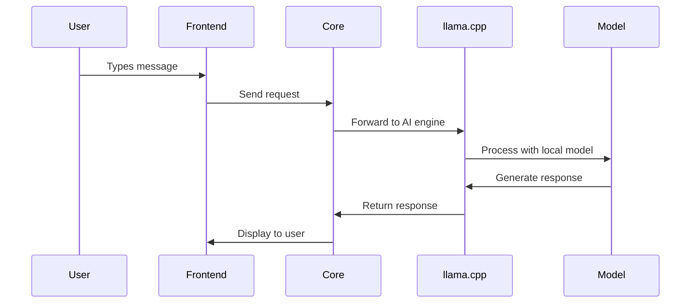
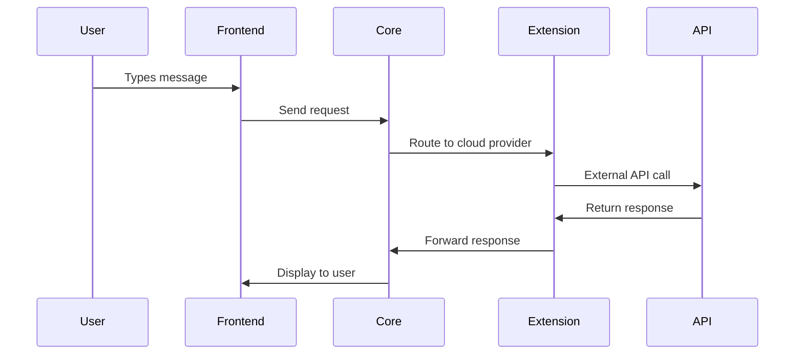

Understanding Jan's architecture helps you troubleshoot issues, optimize performance, and extend functionality.

## High-Level Design

Jan follows a modular architecture:

```
┌─────────────────┐    ┌──────────────┐    ┌─────────────┐
│   Frontend UI   │────│    Core      │────│ llama.cpp   │
│  (Tauri/Web)    │    │  (Business)  │    │ (AI Engine) │
└─────────────────┘    └──────────────┘    └─────────────┘
                              │
                       ┌──────────────┐
                       │  Extensions  │
                       │   System     │
                       └──────────────┘
```

## Core Components

### Frontend Layer
- **Tauri app**: Desktop interface (Windows, macOS, Linux)
- **Web interface**: Browser-based access
- **React-based**: Modern UI components and state management

### Core Engine
- **Business logic**: Thread management, model configuration
- **API layer**: OpenAI-compatible REST API (localhost:1337)
- **Extension system**: Plugin architecture for modularity

### llama.cpp Engine
- **Model inference**: Actual AI processing using llama.cpp
- **Hardware optimization**: CPU, NVIDIA, AMD, Intel Arc support
- **GGUF format**: Optimized model format for efficient local inference

### Extension System
- **Modular design**: Core features as extensions
- **Plugin API**: Custom functionality development
- **Hot-swappable**: Enable/disable features dynamically

## Data Flow

### Local Model Conversation


### Cloud Model Conversation


## File System Organization

```
jan/
├── threads/           # Conversation history
├── models/           # Downloaded AI models
├── extensions/       # Extension configurations
├── settings/         # User preferences
└── logs/            # Application logs
```

See [Data Storage](/explanation/data-storage) for detailed file locations.

## Process Architecture

### Main Process (Tauri)
- **Window management**: Create and manage UI windows using Rust
- **System integration**: File system, notifications, system tray
- **Extension coordination**: Load and manage extensions

### Frontend Process
- **UI rendering**: React components and user interactions
- **State management**: Application state and user preferences
- **API communication**: REST calls to core engine

### llama.cpp Process
- **Model inference**: Isolated AI processing
- **Memory management**: Efficient model loading and caching
- **Hardware abstraction**: Unified interface across different hardware

## Extension Architecture

Extensions provide modularity through a plugin system:

### Core Extensions
- **Model Extension**: Model management and configuration
- **Inference Extension**: Connection to Cortex engine
- **Assistant Extension**: Conversation management
- **Hardware Extension**: System resource monitoring

### Extension Lifecycle
1. **Discovery**: Scan extension directories
2. **Loading**: Initialize extension modules
3. **Registration**: Register capabilities with core
4. **Activation**: Enable extension functionality
5. **Communication**: Handle requests through extension API

### Extension API
Extensions communicate through:
- **Events**: Publish/subscribe messaging
- **Services**: Shared functionality access
- **Storage**: Persistent data management
- **UI hooks**: Interface integration points

## Performance Considerations

### Memory Management
- **Model caching**: Keep frequently used models in memory
- **Context optimization**: Efficient conversation history handling
- **Garbage collection**: Automatic cleanup of unused resources

### Compute Optimization
- **Hardware detection**: Automatic GPU discovery and configuration
- **Batch processing**: Group requests for efficiency
- **Threading**: Parallel processing where beneficial

### Storage Optimization
- **Model compression**: GGUF format for efficient storage
- **Incremental loading**: Load model layers as needed
- **Cache management**: Balance speed vs. storage usage

## Security Model

### Isolation
- **Process separation**: Core, UI, and AI inference in separate processes
- **Extension sandboxing**: Limited system access for extensions
- **Model validation**: Verify model integrity before loading

### Data Protection
- **Local encryption**: Sensitive data encrypted at rest
- **No external communication**: Local models stay local
- **Audit trails**: Track data access and modifications

### API Security
- **localhost binding**: API only accessible from local machine
- **Authentication**: Optional API key protection
- **Rate limiting**: Prevent abuse of local API

## Scalability

### Horizontal Scaling
- **Multiple models**: Run different models simultaneously
- **Load balancing**: Distribute requests across models
- **Resource allocation**: Dynamic memory and compute allocation

### Vertical Scaling
- **Hardware utilization**: Automatic GPU acceleration via llama.cpp
- **Model quantization**: GGUF format optimizations for speed/memory
- **Context management**: Efficient handling of long conversations

## Integration Points

### Developer APIs
- **REST API**: OpenAI-compatible endpoint
- **Extension API**: Plugin development interface
- **IPC communication**: Inter-process messaging

### External Integrations
- **VS Code**: Continue.dev integration
- **IDEs**: Code completion and assistance
- **Automation tools**: Scriptable AI interactions

This architecture enables Jan to be both powerful and flexible while maintaining privacy and performance.