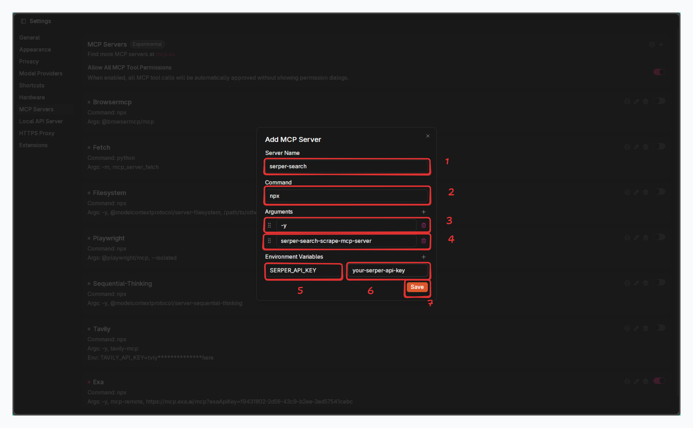
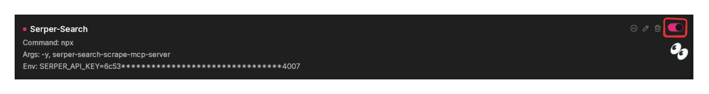

# Serper MCP Server

The Serper MCP server is a tool that allows you to search the web using the Serper API.

Got to Serper

Register, generate an API key and copy it.

pic 1

pic 2

pic 3

Open Jan Desktop and go to the **Settings** > **MCP Servers** tab and click the **+** button to add a new server 
and add the following parameters on the form box.

Make sure the Serper MCP is turned on.

If you have already downloaded models that work well with MCP or have API keys for model providers, you can start a 
new chat and start prompting the model. Otherwise, downldad a model that works well with MCP and start a new chat.

Download Jan-Nano-Gguf

Activate tool use.

